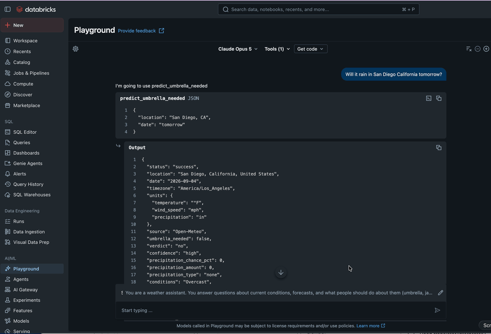

# Weather-Prediction MCP Server + Agent

Homework build for Day 3. Same shape as the Alpaca paper-trading reference in `../mcp_server/`
and `../dashboard/`, but the tools answer weather questions instead of placing trades.

- **`mcp_server/`** - a FastMCP server exposing weather tools over streamable HTTP, deployed as
  its own Databricks App and registered as an external MCP server for an Agent Bricks agent.
- **`dashboard/`** - (extra credit) a small Flask app that shows the predictions the agent has
  made, read from a Lakebase audit table the MCP server writes to.

**Weather API:** [Open-Meteo](https://open-meteo.com/) for current conditions and forecasts,
plus the [NWS / weather.gov API](https://www.weather.gov/documentation/services-web-api) for US
severe-weather alerts. **Auth: none.** Both are keyless and signup-free (Open-Meteo allows
~10,000 calls/day for non-commercial use), so there is no weather API key to leak, rotate, or
store. The only secret anywhere in this project is the Lakebase connection URL used by the
optional prediction log, and that is fetched at runtime via
`WorkspaceClient().secrets.get_secret()` in `mcp_server/lakebase.py` - never hardcoded, never
committed.

## Architecture

```
                 (MCP tool calls, streamable HTTP)
Agent Bricks agent ───────────────────────────────►  Databricks App #1: mcp-weather-prediction
   │                                                   weather_mcp_server.py   (@mcp.tool wrappers)
   │                                                          │
   │                                                          ├── weather_client.py  (ALL HTTP)
   │                                                          │      ├──► Open-Meteo geocoding
   │                                                          │      ├──► Open-Meteo forecast
   │                                                          │      └──► NWS active alerts
   │                                                          │
   │                                                          ├── forecast_rules.py  (thresholds,
   │                                                          │     umbrella + travel judgment)
   │                                                          │
   │                                                          └── prediction_log.py ──┐
   │                                                                (best effort)     │
   │                                                                                  ▼
   └── chat UI                        Databricks App #2: weather-agent-dashboard ──► Lakebase
                                          app.py (Flask, read-only)          weather_predictions
```

Three layers, deliberately separated (this mirrors `alpaca_mcp_server.py` / `alpaca_broker.py`):

| Layer | File | Responsibility |
|---|---|---|
| MCP surface | `mcp_server/weather_mcp_server.py` | `@mcp.tool` wrappers, docstrings, error shaping. No `requests` calls, no thresholds. |
| Adapter | `mcp_server/weather_client.py` | Every HTTP call and every response parse. Raises `WeatherError`. Knows nothing about MCP. |
| Judgment | `mcp_server/forecast_rules.py` | Pure functions turning a forecast into a decision, using the documented `THRESHOLDS` table. No I/O. |

## Tools

| Tool | What it does |
|---|---|
| `get_current_weather(location, units)` | **Required #1.** Temperature, feels-like, humidity, conditions, wind, gusts, day/night for a location right now. |
| `get_forecast(location, days, units)` | **Required #2.** 1-16 day daily forecast: high/low, feels-like, precipitation chance and amount, wind, sunrise/sunset. |
| `predict_umbrella_needed(location, date, units)` | **Required #3.** Derived judgment - see the rule below. |
| `get_travel_recommendation(location, date, units)` | *Stretch.* Travel risk rating + packing list + cautions, forecast combined with active NWS alerts. |
| `get_severe_weather_alerts(location)` | *Stretch.* Active NOAA/NWS watches, warnings, and advisories (US only; reports `covered_by_nws: false` outside the US instead of implying all-clear). |
| `get_historical_weather(location, date, units)` | *Stretch.* What the weather actually **was** on a past date - observations, not a forecast. Recent dates come from Open-Meteo's past-days window, older ones from the ERA5 archive; the `source` field says which. Refuses future dates. |
| `compare_cities(locations, date, units)` | *Stretch.* Ranks 2-5 cities for one day by a documented comfort-score heuristic. |
| `get_recent_predictions(limit)` | *Stretch.* Reads back this server's Lakebase prediction log ("what did you tell me about Austin yesterday?"). |
| `get_current_user()` | Returns the calling end user from Databricks' `X-Forwarded-User` header, same pattern as Day 3. |

`location` accepts a city name (`"Chicago"`, `"Austin, TX"`, `"Paris"`), a US ZIP code
(`"60601"`), or `"latitude,longitude"` (`"41.85,-87.65"`). `date` accepts `"today"`,
`"tomorrow"`, or an ISO `YYYY-MM-DD` within the next 16 days, always interpreted in the
**location's** local timezone (asking for "tomorrow" in Mumbai from California correctly returns
Mumbai's tomorrow). `units` is `"imperial"` (°F/mph/in, default) or `"metric"` (°C/km/h/mm).

### The prediction rule (`predict_umbrella_needed`)

This is the tool that reasons rather than proxies. It reads the daily precipitation probability,
the daily precipitation total, the WMO weather code, the max wind gusts, and the *hour-by-hour*
probabilities, then decides:

- **yes** - daily precipitation chance ≥ **40%**, or ≥ **0.10 in** of precipitation expected
- **maybe** - chance ≥ **25%**, or ≥ **0.02 in** expected
- **no** - below both thresholds

Two overrides sit on top of the core rule:

- **Snow or freezing precipitation** → `umbrella_needed: false` with a "waterproof coat and
  boots" note. An umbrella is the wrong tool, and a passthrough of "70% precipitation" would have
  given the wrong advice.
- **Gusts ≥ 25 mph** → `better_alternative: "hooded rain jacket"`, because an umbrella inverts.

It also returns a **rain window** (the first, last, and peak daytime hours at or above a 40%
hourly chance) so the agent can say *when* to expect rain, and a **confidence** level that drops
to `low` beyond 7 days out. Every threshold used is echoed back in `thresholds_used`, so the
agent (and the grader) can see the reasoning, and they all live in one `THRESHOLDS` dict in
`forecast_rules.py`.

`get_travel_recommendation` layers on a risk rating (`low` / `moderate` / `high`) from alerts,
precipitation totals, gusts, and temperature extremes, plus clothing advice keyed off the daily
low (jacket ≤ 60 °F, heavy coat ≤ 40 °F) and the high-to-low spread (layers when > 25 °F).

### Error handling

No tool ever raises. `weather_client` raises `WeatherError` with a human-readable message
(bad location, unparseable date, date outside the forecast range, upstream timeout, non-200);
the MCP layer converts it to:

```json
{
  "status": "error",
  "message": "Could not find a location matching 'Sprngfeld'. Try a city name, a US ZIP code, or 'latitude,longitude'.",
  "location_requested": "Sprngfeld",
  "hint": "Ask the user to confirm the location ... Do not guess the weather."
}
```

Unexpected exceptions are logged server-side with a traceback and reported generically, so the
agent never receives a stack trace. Failures degrade gracefully in both directions: a
weather.gov outage still yields a travel recommendation (flagged `alerts_checked: false`), and a
Lakebase outage still yields a weather answer (the audit-log write is best effort and never
blocks a response).

## Files

```
weather/
├── README.md                            this file
├── AGENT_SYSTEM_PROMPT.md               system prompt to paste into Agent Bricks
├── DEMO.md                              demo Q&A with real captured tool output
├── mcp_server/                          Databricks App #1
│   ├── weather_mcp_server.py            FastMCP server (8 @mcp.tool functions)
│   ├── weather_client.py                adapter - all HTTP to Open-Meteo + NWS
│   ├── forecast_rules.py                thresholds + umbrella/travel judgment (pure)
│   ├── prediction_log.py                best-effort Lakebase audit log
│   ├── lakebase.py                      Lakebase connection helper (reads the secret)
│   ├── schema_weather_predictions.sql   audit-table DDL
│   ├── test_weather_tools.py            local smoke test over a real MCP client
│   ├── requirements.txt
│   └── app.yaml
└── dashboard/                           Databricks App #2 (extra credit)
    ├── app.py                           Flask read-only UI
    ├── templates/index.html
    ├── weather_client.py                copy (each App deploys from its own folder)
    ├── forecast_rules.py                copy
    ├── prediction_log.py                copy
    ├── lakebase.py                      copy
    ├── requirements.txt
    └── app.yaml
```

Shared modules are duplicated between the two app folders for the same reason Day 3 duplicates
`alpaca_broker.py`: each Databricks App deploys independently from its own folder with its own
`requirements.txt`, and there is no shared package install step across Apps.



*Asking the agent about San Diego in the AI Playground, and the Lakebase-backed dashboard that
records what it decided. Full-size frames and more examples in [`DEMO.md`](DEMO.md).*

## Deployed apps

Both apps run in the `dbc-7e085092-52e4` workspace, deployed from this repo's Git folder:

| App | URL | Notes |
| --- | --- | --- |
| `weather-agent-dashboard` | **[Open the dashboard](https://weather-agent-dashboard-2808874854650870.aws.databricksapps.com)** | Recent agent predictions from Lakebase + a live lookup panel; refreshes every 30s |
| `mcp-weather-prediction` | [App home](https://mcp-weather-prediction-2808874854650870.aws.databricksapps.com) - MCP endpoint is `https://mcp-weather-prediction-2808874854650870.aws.databricksapps.com/mcp` | The `/mcp` suffix is required; the app home page itself is not the endpoint |

Both are behind Databricks workspace auth, so open them in a browser signed in to the
workspace. Only `predict_umbrella_needed` and `get_travel_recommendation` write to the log, so
the dashboard shows judgments the agent made rather than every raw data fetch.

Both read the Lakebase URL from the `database` / `weather-lakebase-url` secret at runtime.
Each Databricks App gets its own service principal, and each one needs `READ` granted on the
secret scope separately - a fresh app inherits nothing.

## Setup

### 1. Run it locally (no credentials at all)

```bash
cd weather/mcp_server
pip install -r requirements.txt
PREDICTION_LOG_ENABLED=false python test_weather_tools.py   # exercises all 9 tools
PREDICTION_LOG_ENABLED=false python weather_mcp_server.py   # serves MCP on :8000/mcp
```

`test_weather_tools.py` drives the server through a real `fastmcp.Client`, including the error
paths (unknown city, `days=99`, `date="not-a-date"`). With `PREDICTION_LOG_ENABLED=false` there
is no Databricks or Lakebase dependency whatsoever - Open-Meteo and weather.gov are keyless.

Dashboard, in a second terminal:

```bash
cd weather/dashboard && pip install -r requirements.txt && python app.py   # UI on :8001
```

### 2. (Optional) create the Lakebase audit table

Only needed for the dashboard and `get_recent_predictions`. Reuse the Day 2/Day 3 Lakebase
instance and the existing `database/lakebase-url` secret, then apply:

```bash
psql "$LAKEBASE_URL" -f mcp_server/schema_weather_predictions.sql
```

To skip Lakebase entirely, set `PREDICTION_LOG_ENABLED: "false"` in `mcp_server/app.yaml`.

### 3. Deploy the MCP server as a Databricks App

Same Git-folder flow as Day 3's step 5:

1. Create (or reuse) a Databricks Git folder for this repo.
2. **Compute → Apps → Create app → Custom**, name it `mcp-weather-prediction` (Databricks requires the `mcp-` prefix for an
   App to be recognized as an MCP server in the AI Playground), and point its
   source at `<git-folder>/weather/mcp_server/` so it picks up that folder's
   `app.yaml`.
3. Deploy, then copy the app URL. The MCP endpoint is that URL plus `/mcp`.

Repeat for the dashboard, pointing at `.../weather/dashboard/` and naming it
`weather-agent-dashboard`.

### 4. Connect an agent to the MCP server

This is a **custom MCP server** (self-hosted as a Databricks App), not an *external* MCP
Service. The two are wired up differently, and the AI Gateway route does not apply here:
Databricks states that "registering Genie, Apps, or Unity Catalog entity sources as an MCP
Service is not currently supported"
([external MCP servers](https://docs.databricks.com/aws/en/generative-ai/mcp/external-mcp)).
AI Gateway / MCP Services is for MCP servers hosted *outside* Databricks.

Two supported paths, per
[Host your own MCP server](https://docs.databricks.com/aws/en/agents/mcp-tools/custom-mcp) and
[Use MCP servers in Custom Agents](https://docs.databricks.com/aws/en/agents/mcp-tools/use-mcp-in-agents):

**a. AI Playground (no code).** Because the app is named `mcp-weather-prediction`, the Playground
recognizes it as an MCP server - "the app name must start with `mcp-` to be recognized as an MCP
server in the AI Playground". Open the Playground, pick a model, add the app under tools, paste
the system prompt from [`AGENT_SYSTEM_PROMPT.md`](AGENT_SYSTEM_PROMPT.md), and ask it the
questions in [`DEMO.md`](DEMO.md). Access is governed by Databricks Apps permissions, so anyone
else testing it needs *Can use* on the app.

**b. Agent code.** Connect directly with `databricks_mcp`, which handles auth for you:

```python
from databricks_mcp import DatabricksMCPClient
from databricks.sdk import WorkspaceClient

mcp_client = DatabricksMCPClient(
    server_url="https://mcp-weather-prediction-2808874854650870.aws.databricksapps.com/mcp",
    workspace_client=WorkspaceClient(),
)
tools = mcp_client.list_tools()   # the 8 weather tools
```

When deploying such an agent as its own App, declare this MCP app as a resource in
`databricks.yml` so the agent's service principal is granted access.

### 5. Build the Agent Bricks agent

1. **Agents → Agent Bricks → Create agent**, type **Custom LLM**.
2. Under **Tools**, add the `weather-prediction` MCP server.
3. Paste the system prompt from [`AGENT_SYSTEM_PROMPT.md`](AGENT_SYSTEM_PROMPT.md).

   **Model:** nothing in this repo pins an LLM - the MCP server only serves tools, so the model
   is chosen on the Databricks side. Agent Bricks **Custom LLM** selects and optimizes the model
   for you (it compares strategies, including fine-tuning, and you deploy the best candidate).
   If you drive the tools from the **AI Playground** or a code-authored agent instead, pick a
   [Foundation Model APIs](https://docs.databricks.com/aws/en/machine-learning/foundation-model-apis/supported-models)
   endpoint explicitly - `databricks-claude-opus-5` for the strongest tool-calling,
   `databricks-claude-sonnet-5` as a cheaper default, `databricks-claude-haiku-4-5` for
   low-latency chat. These tools are small and well-typed, so any of the three handles them.
4. Evaluate against sample prompts (the ones in [`DEMO.md`](DEMO.md) work well), then deploy and
   chat with it.

## Demo

[`DEMO.md`](DEMO.md) has four natural-language questions with the tool calls they trigger and the
real JSON those tools returned.

## Notes and limits

- **No secrets committed.** Nothing in `weather/` reads an API key, and `.gitignore` already
  excludes `.env`. The Lakebase URL is read through the Databricks secret scope at runtime.
- **Fair use.** Open-Meteo's free tier is ~10k calls/day. Geocoding results are cached per
  process, and `predict_umbrella_needed` costs two forecast calls (one to resolve the location's
  local calendar, one for hourly detail).
- **Forecast horizon** is 16 days; anything beyond that returns a clean error naming the
  available range rather than an extrapolation.
- **NWS alerts are US-only.** Outside US coverage the tool returns `covered_by_nws: false`, and
  the system prompt tells the agent to say "no US alert coverage" rather than "no alerts".
